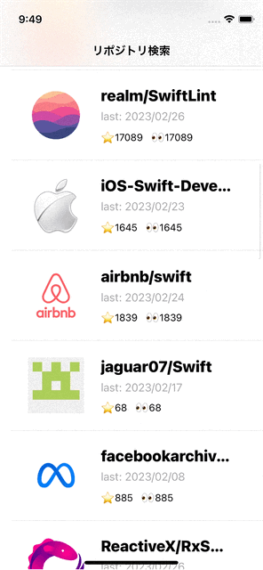
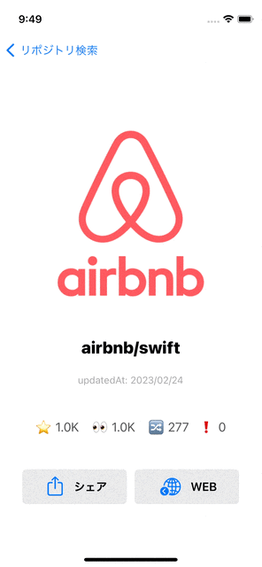
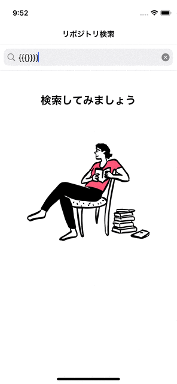
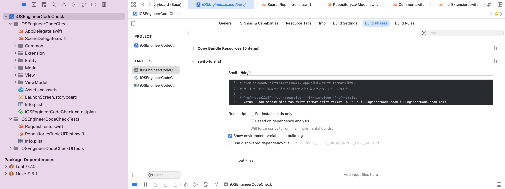

# 株式会社ゆめみ iOS エンジニアコードチェック課題

## 内容

株式会社ゆめみ インターン iOS提出課題
課題リポジトリ: https://github.com/yumemi-inc/ios-engineer-codecheck


## 対象機種・アプリ仕様・説明

本アプリはGitHubのリポジトリを検索するアプリです。

- 対象OS: iOS16.1
- 対象機種: iPhoneのみ

| リポジトリ検索(一覧表示) | リポジトリ詳細 | シェア・WEB画面表示 |
| ------ | ------ | ------ |
|  |   |  |

### 検索ホーム
- アプリの初期画面
- SearchBarにキーワードを入力することでGithubのリポジトリ一覧を表示
- 各セルには`所有者のアイコン`, `リポジトリ名`, `最終更新日`, `スター数` を表示
    - リポジトリ閲覧のために必要な最低限の項目
- インスタグラムやデモアプリを[参考](https://github.com/hamadayuuki/yumemi-ios-engineer-codecheck/issues/25)にUIを構成
- セルをタップすることで詳細画面に遷移可能

### 詳細
- 検索結果を表示
- `所有者のアイコン`, `リポジトリ名`, `最終更新日`,  `スター数`, `閲覧数` `フォーク数`, `iSuue数` を表示
- `シェア`, `WEB` ボタンを表示

### シェア・WEB画面表示
- `シェア` を押すことでリポジトリを他SNSへ共有可能となります
- `WEB` を押すとアプリ内でブラウザを開きリポジトリ詳細を確認可能です
    - ユーザーのアプリ離脱率を考慮してアプリ内でブラウザを開いています

### その他

- 検索画面と詳細画面Readmeがロード中は`UIActivityIndicator`でロード中表示
- エラーが発生した場合は[Loaf](https://github.com/schmidyy/Loaf)を使用しトーストでメッセージを表示

| エラーメッセージ |
| ------- |
  |

## 実行環境設定

### Xcode

前提として、Xcode@14.1 と homebrew はインストールされているものとします。

#### 1. homebrew で mint をインストール

CLI は mint で管理しています。
CLIには[apple/swift-format](https://github.com/apple/swift-format)が含まれます。

Appleが公開しているコード整形ライブラリ。swift-formatの整形規則は[.swift-format](https://github.com/hamadayuuki/yumemi-ios-engineer-codecheck/blob/main/.swift-format)に記述しています。

```sh
brew install mint
```

#### 2. mint で管理している CLI をインストール

Mintfile に書かれている CLI がインストールされます。インストールした CLI は `mint run <command名>` で実行可能です。

```sh
mint bootstrap
```

#### 3. swift-fomatを使用した自動整形の実行

`Xcode > Bulid Target(iOSEngineerCodeCheck) > Bulid Phases > +`



Bulid Phases に `swift-format` という名称で、以下の自動実行用のスクリプトを書く。

対象のスキーム(今回はiOSEngineerCodeCheck)がビルドされるたびに以下のスクリプトが実行される。

```sh
# nicklockwood/SwiftFormatではなく、Apple標準のswift-formatを使用
# サードパーティー製のライブラリを極力使いたくないというモチベーションから

# `-p/--parallel` `-r/--recursive` `-i/--in-place` `-s/--strict`
  xcrun --sdk macosx mint run swift-format swift-format -p -r -i iOSEngineerCodeCheck iOSEngineerCodeCheckTests iOSEngineerCodeCheckUITests
```

#### その他. アプリ内で使用してるライブラリのインストール

アプリ内で使用しているライブラリは全て`Swift Package Manager`を用いて導入しているため、`.xcodeproj`を開くと自動でダウンロードされます。

ライブラリに依存しないアプリケーションとするため、インストールを極力しないようにした。
Apple標準のライブラリで代用できる時には、Apple標準のものを使用。(例: Combine, URLSession, swift-format...)


| ライブラリ名 | 用途 |
| ------ | ------ |
| [Nuke@9.6.1](https://github.com/schmidyy/Loaf) | URLから画像を取得, 画像のキャッシュ |
| [Loaf@0.70](https://github.com/kean/Nuke.git) | 画像取得 |


### Github Actions

Gihtub Actions を使用して mainブランチ へのプルリク時に、テストを[自動実行](https://github.com/hamadayuuki/yumemi-ios-engineer-codecheck/actions)しています。
`テスト = UnitTests/UITests スキーム` (スキームは任意で作成したもの)

自動実行の内容は [XCTest.yml](https://github.com/hamadayuuki/yumemi-ios-engineer-codecheck/blob/main/.github/workflows/XCTest.yml) に示しています。

## アーキテクチャ

- `MVVM`アーキテクチャを採用
    - データバインディングを用いた一般的なアーキテクチャが課題に適していると考えたため
    - データバインディングとして`Combine`を使用
    - 非同期処理を可能とするためURLSessionでのリクエストでは`Async/await`を使用
- レイアウトは主に`StoryBoard`を利用, 1`StoryBoard`-1`ViewController`方式を採用
    - segueの遷移よりコードでの遷移の方がハンドリングしやすいと考えたため
    - 1つの`StotryBoard`で複数画面を管理するのは複数ブランチでの同時作業をしたい場合に非効率だと考えたため

以下は参考となるPRです。

- [Issue/6: MVVMアーキテクチャを導入](https://github.com/hamadayuuki/yumemi-ios-engineer-codecheck/pull/14)
- [Issue/2: VCとStoryboardの関係を 1対1 とする](https://github.com/hamadayuuki/yumemi-ios-engineer-codecheck/pull/15)
### テスト

以下のPRの説明欄をご覧ください。

- [テストを追加/API・Repository・Usecaseの単体テスト,結合テスト](https://github.com/kntkymt/yumemi-ios-engineer-codecheck/pull/17)
- [テストを追加/UIテストを追加する](https://github.com/kntkymt/yumemi-ios-engineer-codecheck/pull/18)

## 取り組んだについて

- ゆめみさんが用意したissueと、追加で取り組んだissue の2種類があります。
    - `初級`, `中級`, `上級`, `ボーナス` のラベルが割り当てられたissueがゆめみさんの用意したissueです。
- 各PRに関係する課題をラベルとしてつけてあります。
- 課題部分の変更を確認したい場合は以下を参考にissueをご覧ください。

| issue |
| ------ |
| [ソースコードの可読性の向上](https://github.com/hamadayuuki/yumemi-ios-engineer-codecheck/issues/2) |
| [バグを修正](https://github.com/hamadayuuki/yumemi-ios-engineer-codecheck/issues/3) |
| [FatVCの回避](https://github.com/hamadayuuki/yumemi-ios-engineer-codecheck/issues/4) |
| [プログラム構造をリファクタリング](https://github.com/hamadayuuki/yumemi-ios-engineer-codecheck/issues/5) |
| [アーキテクチャを適用](https://github.com/hamadayuuki/yumemi-ios-engineer-codecheck/issues/6) |
| [テストを追加](https://github.com/hamadayuuki/yumemi-ios-engineer-codecheck/issues/9) |
| [UIをブラッシュアップ](https://github.com/hamadayuuki/yumemi-ios-engineer-codecheck/issues/7) |
| [新機能を追加](https://github.com/hamadayuuki/yumemi-ios-engineer-codecheck/issues/8)|
| [リポジトリの共有を可能にする](https://github.com/hamadayuuki/yumemi-ios-engineer-codecheck/issues/17) |
| [リポジトリをブラウザから閲覧可能にする](https://github.com/hamadayuuki/yumemi-ios-engineer-codecheck/issues/18) |
| [APIを叩く場合のエラーハンドリング](https://github.com/hamadayuuki/yumemi-ios-engineer-codecheck/issues/23) |
| [UI/UXの改善](https://github.com/hamadayuuki/yumemi-ios-engineer-codecheck/issues/25) |
| [無限スクロールを可能に](https://github.com/hamadayuuki/yumemi-ios-engineer-codecheck/issues/28) |


